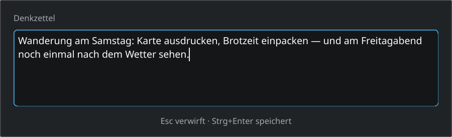
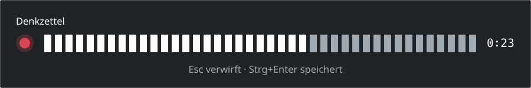
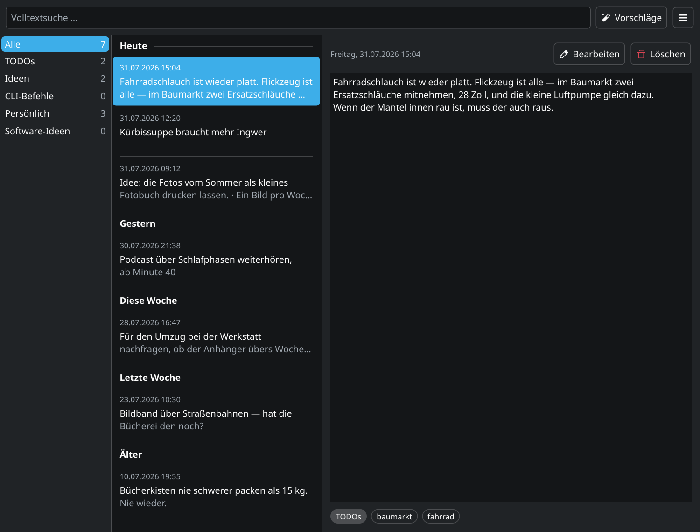

# Denkzettel

[](https://github.com/hnsstrk/denkzettel/actions/workflows/ci.yml)
[](LICENSE)

Ein Notizzettel für KDE Plasma. `Meta+N` drücken, tippen, `Strg+Enter`. Die
Notiz ist gespeichert, das Fenster ist weg. Kein Dateiname, kein
Speichern-Dialog, keine Frage, wohin damit.

🇬🇧 [English version](README.md)

> **Die Oberfläche ist auf Englisch.** Eine deutsche Übersetzung liegt dem
> Quelltext bei (`po/de/denkzettel.po`) und wird mitinstalliert — in einer
> deutschen Sitzung erscheint das Programm ohne weiteres Zutun auf Deutsch.



Ich habe Denkzettel gebaut, weil mir beim Arbeiten ständig Sachen einfallen,
die woanders hingehören: eine Idee, eine offene Frage, ein Kommandozeilen-Fund.
Wenn ich dafür erst eine Datei anlegen muss, ist der Gedanke weg. Was sich
lohnt, wandert später in den Obsidian-Vault.

Den Code schreibe ich nicht selbst: **Denkzettel wird mit Claude Code
entwickelt**, ich gebe Ziele, Prioritäten und Freigaben vor —
[Wie hier gearbeitet wird](#wie-hier-gearbeitet-wird).

## Was es kann

- **Erfassen mit einem Tastendruck**, ohne Dateinamen und ohne Dialog. `Meta+N`
  wird über KGlobalAccel als globales Kürzel angemeldet; hält eine andere
  Komponente das Kürzel bereits, sagt der Erststart das in einer Benachrichtigung,
  statt still danebenzugreifen.
- **Sprachnotizen auf einen zweiten Tastendruck.** `Meta+Umschalt+N` öffnet ein
  Aufnahmefenster, das bereits aufnimmt — kein Startknopf, ein roter Punkt, eine
  Pegelanzeige und die laufende Zeit. `Strg+Enter` sichert die Aufnahme als
  Audio-Notiz und reiht sie zur Transkription ein, `Esc` verwirft sie samt
  Datei. Bei fünfzehn Minuten endet die Aufnahme so, wie `Strg+Enter` sie
  beendet, und ab Minute vierzehn sagt das Fenster das.
- **Eine Bibliothek mit allen Notizen**, nach Tagen gruppiert wie ein
  Posteingang: Heute, Gestern, Diese Woche, Letzte Woche, Älter. `F2` öffnet den
  Editor, `Entf` löscht mit fünf Sekunden Rückgängig-Möglichkeit, `Strg+Enter`
  speichert eine Bearbeitung und `Esc` bricht sie ab. Wer eine Bearbeitung mit
  ungespeicherten Änderungen verlässt, wird vorher gefragt.
- **Volltextsuche** über einen Trigramm-Index von SQLite FTS5. Sie trifft
  innerhalb von Wörtern, nicht nur am Wortanfang — „grafieren" findet
  „fotografieren" —, und sie faltet Diakritika, deshalb findet „bucher" auch
  „Bücher". Begriffe aus einem oder zwei Zeichen können in keinem
  Trigramm-Index stehen und laufen über einen Teilstring-Vergleich, damit „KI"
  etwas findet statt nichts. „ß" wird nicht gefaltet; das ist eine Grenze des
  Tokenizers und durch einen Test festgehalten.
- **Symbole und Beschriftungen kommen aus dem System**, ein Wechsel des
  Farbschemas wird im laufenden Programm übernommen.
- **Das Erfassungsfenster trägt die Hülle des Desktop-Themes** — Rundung,
  Kontur, Schatten, der Rahmen des Eingabefeldes und seine Fokusschicht werden
  von dort gezeichnet, nicht aus fest eingebauten Werten.
- **Läuft im Hintergrund**, sitzt im Systemabschnitt der Kontrollleiste, startet
  mit der Sitzung.
- **Alles bleibt lokal** in einer SQLite-Datei. Nichts verlässt den Rechner.





### Noch nicht gebaut

Die Spezifikation beschreibt erheblich mehr, als das Programm heute tut. Was
aufgeschrieben und nicht gebaut ist:

- **KI-Analyse** — Klassifikation, Tags, Kategorien-Sidebar, Ollama und
  OpenAI-kompatible Anbieter. Der Tray-Eintrag ist da und inaktiv.
- **Vorschläge** — Embeddings, Themen-Clustering, Bündel- und Task-Vorschläge
  mit Review-Oberfläche. Der Tray-Eintrag ist da und inaktiv.
- **Überführungen** nach Obsidian und Taskwarrior sowie ein Voll-Export als
  Rettungsweg.
- **Ein Einstellungsdialog.** Es gibt keinen; was einstellbar ist, steht in
  `denkzettelrc` oder gar nicht.
- **Such-Operatoren** (`tag:`, Datumsbereiche und der Rest von SPEC 6). Die
  Suche nimmt heute einfache Begriffe und verknüpft sie mit UND.

Was gerade ansteht, steht in den
[Issues](https://github.com/hnsstrk/denkzettel/issues); die bindende
Spezifikation ist [`SPEC.md`](SPEC.md).

## Voraussetzungen

- CMake ab 3.20, ein C++20-Übersetzer, `extra-cmake-modules`
- Qt 6.7 (DBus, Multimedia, Widgets, Sql) — QtMultimedia braucht das
  **ffmpeg**-Backend (`qt6-multimedia-ffmpeg`); die Paketabhängigkeit ist eine
  virtuelle mit zwei Anbietern, und der gstreamer-Anbieter schreibt andere
  Formate als das Opus in OGG, in dem die Sprachnotiz aufgenommen wird
- KDE Frameworks 6: ColorScheme, Config, CoreAddons, DBusAddons, GlobalAccel,
  I18n, Notifications, StatusNotifierItem, Svg, WidgetsAddons, WindowSystem
- `ffmpeg`, das Programm — die Transkription wandelt eine Aufnahme damit in ein
  vorübergehendes WAV mit 16 kHz in Mono um, bevor whisper.cpp sie sieht; der
  Testlauf tut dasselbe
- gettext (`msgfmt`) für die Nachrichtenkataloge
- AppStream (`appstreamcli`) — ohne das Programm bricht die Konfiguration ab:
  der Testlauf prüft die AppStream-Beschreibung, die ein Software-Center liest
- libplasma zur Laufzeit — von dort kommen die Desktop-Themes, aus denen das
  Erfassungsfenster seine Hülle zeichnet — sowie die Breeze-Symbole
- Nur für die Transkription und nur zur Laufzeit: `whisper-cpp` mit einem
  GGML-Backend (`ggml-vulkan`, unter ROCm `ggml-hip`) und ein Modell unter
  `~/.local/share/denkzettel/models/`. Zum Bauen und Prüfen braucht es beides
  nicht — der Testlauf setzt an die Stelle von whisper-cli ein eigenes
  Programm. Ein Lauf wird nach fünf Minuten aufgegeben, gerechnet über den
  ganzen Auftrag: Denkzettel hält kurze Notizen fest und ist kein Audiorekorder
  — die Aufnahme selbst endet ohnehin nach fünfzehn Minuten. Beide Pfade sind
  Einstellungen in `denkzettelrc`:

  ```ini
  [Transcription]
  FfmpegProgram=/usr/bin/ffmpeg
  WhisperProgram=/usr/bin/whisper-cli
  ModelSize=small
  ```

  Die Größe ist eine von `tiny`, `base`, `small`, `medium` und `large-v3`, die
  Datei folgt daraus: `~/.local/share/denkzettel/models/ggml-<größe>.bin`.
  Modellgröße und Programmpfad sind zugleich die Einstellungsseite
  „Sprachnotizen"; was dort gesetzt wird, wirkt sofort, ohne den Dienst neu zu
  starten.

  **Geholt wird das Modell ebenfalls dort.** Eine Größe, die nicht auf der
  Platte liegt, steht als „medium — nicht heruntergeladen" in der Liste; sie zu
  wählen fragt einmal nach und nennt dabei die Dateigröße, die Zeile unter der
  Liste trägt dann den Fortschritt, und der Knopf daneben bricht ab. Geladen
  wird von der Adresse, aus der auch das Skript `models/download-ggml-model.sh`
  des Projekts whisper.cpp holt, und geschrieben erst, wenn die SHA-1 stimmt,
  die dessen `models/README.md` nennt — ein Abbruch, ein Verbindungsfehler und
  ein abgestürzter Dienst hinterlassen denselben Zustand, nämlich gar keine
  Datei. Die Warteschlange lädt nie selbst, und ein fehlendes Modell kostet
  eine Notiz nichts: Der Auftrag bleibt mit unveränderten Versuchen in der
  Schlange, die Kurzinfo am Symbol sagt, welches Modell fehlt und wo es zu
  holen ist, und sobald die Datei da ist, nimmt die Schlange den Auftrag von
  selbst wieder auf.

  Bis v0.7.0 hieß der Schlüssel `ModelPath` und trug einen ganzen Dateinamen.
  Der erste Start übernimmt ihn: Ein Pfad, der auf `ggml-<größe>.bin` endet,
  wird zu dieser Größe, der alte Schlüssel verschwindet. Ein Pfad, der auf
  nichts davon abbildet, bleibt stehen — die Größe fällt auf `small` zurück,
  und die Einstellungsseite sagt das mit dem alten Pfad im Text, bis die
  Einstellungen einmal angewendet werden.

Auf Arch und Ablegern:

```sh
sudo pacman -S --needed cmake extra-cmake-modules gettext ffmpeg qt6-base \
    qt6-multimedia qt6-multimedia-ffmpeg \
    kcolorscheme kconfig kcoreaddons kdbusaddons kglobalaccel ki18n \
    knotifications kstatusnotifieritem ksvg kwidgetsaddons kwindowsystem \
    kxmlgui libplasma breeze-icons appstream
```

## Bauen und installieren

```sh
cmake -B build -S . -DCMAKE_INSTALL_PREFIX=/usr
cmake --build build
sudo cmake --install build
```

Wo kein Terminal nach dem Passwort fragen kann, derselbe Schritt über einen
grafischen Dialog — `pkexec` braucht für Programm und Bauverzeichnis absolute
Pfade:

```sh
pkexec /usr/bin/cmake --install "$PWD/build"
```

Das Präfix `/usr` ist nicht kosmetisch. Der Kürzeldienst von Plasma findet die
Aktion nur, wenn die Desktop-Datei systemweit liegt, und der Autostart-Eintrag
wird nur aus `/etc/xdg/autostart` gelesen — dorthin legt ihn das Präfix `/usr`.

Danach `denkzetteld` einmal starten oder neu anmelden; künftig übernimmt das
der Autostart-Eintrag.

### Als Paket (Arch und Ableger)

`packaging/PKGBUILD` baut denselben Stand als Paket, aus dem Git-Tag der
Fassung, die es nennt:

```sh
cd packaging
makepkg -si
```

`makepkg` holt die fehlenden Bauabhängigkeiten selbst, lässt den Testlauf
durchlaufen, und `-i` übergibt das fertige Paket an `pacman`. Das Präfix ist
`/usr`, damit der Autostart-Eintrag in `/etc/xdg/autostart` landet und der
Kürzeldienst von Plasma die Desktop-Datei findet — dieselben zwei Bedingungen
wie bei der Installation aus dem Quelltext darüber. Was das Paket außer dem
Programm mitbringt: den Desktop-Eintrag, den gleichnamigen Autostart-Eintrag,
die AppStream-Beschreibung, beide Symbole und den deutschen Katalog. Eine eigene
`.notifyrc` hat Denkzettel nicht — der Warnton des Schutzdialogs ist das
Plasma-Ereignis `messageWarning` (SPEC 9).

`whisper-cpp` und ein GGML-Backend bleiben **optional** und stehen als
`optdepends` darin: Ohne sie behält eine Sprachnotiz ihre Aufnahme und bleibt
abspielbar, und der Grund steht in der Auftragszeile der Datenbank und im
Journal (`journalctl --user -t denkzetteld`).

`pkgver` ist die zweite Stelle, an der die Versionsnummer steht. Sie folgt
`project(denkzettel VERSION …)` der obersten `CMakeLists.txt` und dem Tag
derselben Nummer — beide ändern sich gemeinsam, sonst holt `makepkg` eine andere
Fassung als die, die die Arbeitskopie hat.

### Umstieg von einer älteren Fassung

Die Kennung der Anwendung lautet `io.github.hnsstrk.denkzettel` — der
Desktop-Eintrag, die AppStream-Komponente und die Kürzel-Komponente in Plasma
tragen sie alle. Die Installation legt die neuen Dateien **neben** die alten,
statt sie zu ersetzen; die beiden, die stehen bleiben, müssen weg:

```sh
sudo rm -f /usr/share/applications/org.denkzettel.Denkzettel.desktop \
           /etc/xdg/autostart/org.denkzettel.Denkzettel.desktop
```

Unterlässt man das, liest die Sitzung **zwei** Autostart-Einträge — XDG
verschattet sie über den Dateinamen, und die Namen unterscheiden sich jetzt. Sie
startet `denkzetteld` zweimal, der zweite Start wird dem laufenden als
Aktivierung übergeben, und die hängt am Erfassungsfenster: **bei jeder Anmeldung
springt das Erfassungsfenster auf.** Daneben halten dann zwei Komponenten
`Meta+N`, und die Kürzel-Einstellungen führen *Denkzettel* zweimal auf. Der
Tastendruck selbst funktioniert die ganze Zeit: beide Einträge tragen dasselbe
`Exec=denkzetteld` und dieselbe Aktion, und welchen der beiden er erreicht, endet
am selben Fenster. Die Konfliktmeldung bleibt aus — sie erscheint nur beim
Erststart, und den hat eine Installation, die aktualisiert wird, hinter sich.

Mit den beiden Dateien sind beide Erscheinungen weg. Die Gruppe
`[services][org.denkzettel.Denkzettel.desktop]` bleibt in
`~/.config/kglobalshortcutsrc` stehen, und sie darf das: gemessen am 28.08.2026
in einer eigenen Sitzung lädt der Kürzeldienst daraus überhaupt keine Komponente
mehr, sobald der Desktop-Eintrag nicht mehr auffindbar ist, und `Meta+N` hat
genau einen Halter, den neuen. Die Datei von Hand zu ändern bringt ohnehin
nichts — der laufende Dienst schreibt sie zurück.

Eine von Hand geänderte Tastenfolge wandert bei der Umbenennung nicht mit: sie
steht in der Gruppe der alten Komponente, und die neue startet wieder auf
`Meta+N`.

Der D-Bus-Dienstname ist mitgewandert — Skripte, die `org.denkzettel.Daemon`
rufen, brauchen eine geänderte Zeile, siehe [Bedienung](#bedienung) weiter unten.

## Bedienung

`Meta+N` öffnet das Erfassungsfenster, `Strg+Enter` speichert, `Esc` verwirft.
Die Bibliothek erreicht man über das Tray-Symbol.

`denkzetteld --version` sagt, welche Fassung läuft, `denkzetteld --help` listet
die Schalter. Beide antworten auch, während der Dienst schon läuft.

Für Skripte gibt es eine D-Bus-Schnittstelle, `io.github.hnsstrk.denkzettel`
unter `/Daemon`:

```sh
qdbus6 io.github.hnsstrk.denkzettel /Daemon AddNote "Text der Notiz"
qdbus6 io.github.hnsstrk.denkzettel /Daemon ShowCapture
qdbus6 io.github.hnsstrk.denkzettel /Daemon ShowLibrary
qdbus6 io.github.hnsstrk.denkzettel /Daemon Quit
```

`AddNote` gibt die Id der neuen Notiz zurück, 0, wenn nichts gespeichert wurde.

**Bis Fassung 0.7.0 hieß der Dienst `org.denkzettel.Daemon`.** Der Daemon meldet
jetzt allein diesen einen Namen an; ein Skript gegen den alten bekommt von
`qdbus6` oder `dbus-send` einen Fehler zurück, den im Hintergrundlauf niemand
liest. Zu ändern ist der Dienstname; der Objektpfad `/Daemon` und alle vier
Methodennamen bleiben, wie sie sind. Wo der Aufruf zusätzlich die Schnittstelle
nennt, wie `dbus-send --dest=… /Daemon <Schnittstelle>.<Methode>`, heißt sie
künftig `io.github.hnsstrk.denkzettel.Daemon`.

Die Notizen liegen in `~/.local/share/denkzettel/denkzettel.db`. Ändert ein
Update das Schema, wird der Bestand beim ersten Start umgewandelt; was sich
ändert, steht im [Changelog](CHANGELOG.md).

## Mitwirken

Fehlermeldungen und Ideen gern als
[Issue](https://github.com/hnsstrk/denkzettel/issues). Wer Code beisteuern will,
findet hier den Einstieg.

### Bauen und Testen

```sh
cmake -B build -S . -DCMAKE_BUILD_TYPE=Debug
cmake --build build
ctest --test-dir build
```

Die Tests laufen offscreen und brauchen keine laufende Plasma-Sitzung.

### Linter

Zwei Targets, die auf Anforderung laufen und nichts verändern:

```sh
cmake --build build --target lint-tidy    # clang-tidy
cmake --build build --target lint-clazy   # clazy, Qt-Semantik
```

Beide sehen nur `src/` und `tests/` und stehen auf **null Befunden**. Wo ein
Befund bewusst stehenbleibt, steht ein `NOLINT` mit der Begründung daneben.
Bekannte Lücke: clazy prüft `tr()`, wir benutzen aber `i18n()`.

### Übersetzungen

Die Quellsprache ist Englisch: die `msgid` ist die Zeichenkette, die im Code
steht, und jede sichtbare Zeichenkette geht durch `i18n()` oder eine seiner
Verwandten. Deutsch liegt in `po/de/denkzettel.po`.

Wer eine sichtbare Zeichenkette hinzufügt, entfernt oder umformuliert, ruft im
Projektstamm den Auszug auf. Er baut `po/denkzettel.pot` aus `src/` neu und
mischt sie in jeden Katalog unter `po/<sprache>/` ein:

```sh
./po/Messages.sh
```

Eine neue Sprache braucht ein Verzeichnis und eine Datei, am Bau ändert sich
nichts:

```sh
mkdir -p po/fr
msginit --input=po/denkzettel.pot --locale=fr --output-file=po/fr/denkzettel.po
msgfmt --statistics -o /dev/null po/fr/denkzettel.po   # was noch fehlt
```

`ki18n_install(po)` in der obersten `CMakeLists.txt` liest die Sprache aus dem
*Verzeichnisnamen* und die Domain aus dem Dateinamen. Es nimmt den neuen Katalog
beim nächsten Konfigurationslauf mit und installiert ihn als
`share/locale/fr/LC_MESSAGES/denkzettel.mo` — genau der Pfad, in dem
`KLocalizedString::setApplicationDomain("denkzettel")` sucht. Daher der Aufbau
`po/<sprache>/denkzettel.po`; ein `po/fr.po` würde einen Katalog namens `fr`
installieren, den keine Sitzung je fände.

Die Testsätze lesen die Quellzeichenketten und keinen Katalog: `LANGUAGE=en_US`
in `tests/CMakeLists.txt` hält einen installierten deutschen Katalog von den
Prüfungen fern, die englische Formulierungen vergleichen.

### Bilder

Die Bilder beider READMEs stammen aus `readmeshots`. Der Läufer wird mit der
Testsuite gebaut, steht aber bewusst **nicht** in `ctest` — ein kaputter
Bildschreiber soll die Suite nicht rot färben. Mitgebaut wird er trotzdem, weil
ein Läufer, den niemand neu baut, unbemerkt altert und dann plausible Bilder
eines **alten** Standes mit frischem Zeitstempel schreibt.

Das Aufnahmefenster bringt sein eigenes Signal mit: Der Läufer füttert den
Encoder mit einem Ton fester Amplitude, statt das Mikrofon der Maschine zu
öffnen — deshalb stehen in jedem Lauf dieselben 25 der 41 Balken. Die Amplitude
ist 3277 von 32768 Vollausschlag, also −20 dBFS und der Spitzenwert, den eine
Stimme in bequemem Abstand zum Mikrofon erreicht; die Anzeige rechnet in Dezibel
über einer Untergrenze von −50, auf der linearen Skala bis zum 29.08.2026 hätte
derselbe Ton vier Balken erreicht.

Ein Lauf schreibt **einen** Sprachsatz, und drei Dinge im Bild haben drei
verschiedene Quellen: Die Beschriftungen kommen aus dem Nachrichtenkatalog
(`LANGUAGE`), die Zeitstempel aus `QLocale` (`LANG`/`LC_ALL`), und die erfundenen
Notizen richten sich ebenfalls nach dem Gebietsschema. Alle drei müssen
gemeinsam gesetzt werden, sonst entsteht die schlimmste Art von Bild — eines,
das plausibel aussieht und ein englisches Fenster mit deutschen Datumsangaben
zeigt.

Außerdem wirft der Läufer sein eigenes Konfigurationsverzeichnis weg, damit die
Bilder den Auslieferungsstand zeigen und nicht die Fenstergröße, die jemand
gespeichert hat. Das hat eine zweite Folge: Ohne `plasmarc` fällt er auf das
Standard-Desktop-Theme (hell) zurück, während er selbst eine dunkle Palette
setzt — der Notiztext steht dann hell auf hell. Also ein passendes Theme nennen.

```sh
cmake --build build --target readmeshots

conf=$(mktemp -d)
printf '[Theme]\nname=breeze-dark\n' > "$conf/plasmarc"

# Englisch — die Quellsprache, kein Katalog im Spiel
env -u LANGUAGE LANG=en_US.UTF-8 LC_ALL=en_US.UTF-8 \
    XDG_CONFIG_DIRS="$conf:/etc/xdg" \
    QT_QPA_PLATFORM=offscreen QT_QPA_PLATFORMTHEME=kde QT_SCALE_FACTOR=1.5 \
    QT_FORCE_STDERR_LOGGING=1 \
    build/bin/readmeshots docs/images

# Deutsch — der Katalog muss zur Laufzeit auffindbar sein. Über DESTDIR in eine
# Wegwerf-Wurzel installiert, außerhalb davon wird nichts geschrieben.
dest=$(mktemp -d)
DESTDIR="$dest" cmake --install build

env LANGUAGE=de LANG=de_DE.UTF-8 LC_ALL=de_DE.UTF-8 \
    XDG_DATA_DIRS="$dest/usr/share:/usr/share" XDG_CONFIG_DIRS="$conf:/etc/xdg" \
    QT_QPA_PLATFORM=offscreen QT_QPA_PLATFORMTHEME=kde QT_SCALE_FACTOR=1.5 \
    QT_FORCE_STDERR_LOGGING=1 \
    build/bin/readmeshots docs/images/de
```

Zum Beleg wird der zweite Aufruf erst durch die Gegenprobe: derselbe Aufruf
**ohne** `XDG_DATA_DIRS` muss ein englisches Fenster liefern. Tut er das nicht,
war nicht der Katalog der Unterschied. Eine Fußangel dabei: Die Zeile
`-h, --help  Zeigt Hilfe …` ist in beiden Fällen deutsch — sie kommt aus Qts
eigenem Katalog, nicht aus dem dieses Projekts, und taugt nicht als Beleg.

`QT_FORCE_STDERR_LOGGING=1` sorgt dafür, dass der Lauf sagt, womit er gezeichnet
hat — den aufgelösten Stil und die beiden Farben, aus denen die Pillen des
Detailbereichs gemischt werden, dazu die Pixelgröße jedes Bildes. Ohne die
Variable landen diese Zeilen im Journal statt auf stderr, sobald die Ausgabe
umgeleitet wird, und ein stummer Lauf sieht aus wie einer, der nichts zu melden
hatte.

`QT_QPA_PLATFORMTHEME=kde` muss gesetzt sein: Sonst tritt eine Ersatzschrift an
die Stelle der echten und stellt die Größenverhältnisse falsch dar. Der Läufer
arbeitet deterministisch — zwei Läufe hintereinander liefern bytegleiche
Dateien. Die gezeigten Notizen sind erfunden.

Beide Bilder entstehen offscreen. Das zeigt Geometrie, Textsatz, Farbrollen und
den Rahmen, den das Desktop-Theme zeichnet — **nicht** Schatten und Unschärfe
hinter dem Erfassungsfenster, die vom Compositor kommen und die kein
Offscreen-Lauf hat.

#### Hülle, Schatten und Titelleiste

Was der Compositor zeichnet, braucht einen Compositor — und es wird nie aus der
Sitzung genommen, in der jemand arbeitet: Dessen Notizen sind persönliche Daten
und dieses Repository ist öffentlich. Ein verschachtelter `kwin_wayland` auf
einem eigenen Bus leistet das, mit einem Wegwerf-`HOME`, dessen Datenbank leer
beginnt:

```sh
sand=$(mktemp -d)
mkdir -p "$sand/.config"
printf '[Theme]\nname=breeze-dark\n' > "$sand/.config/plasmarc"
printf '[General]\nColorScheme=BreezeDark\n' > "$sand/.config/kdeglobals"

dest=$(mktemp -d); DESTDIR="$dest" cmake --install build      # für den Katalog

cat > "$sand/run.sh" <<'SCRIPT'
#!/bin/sh
"$PWD/build/bin/denkzetteld" &
sleep 6
dbus-send --session --dest=io.github.hnsstrk.denkzettel /Daemon io.github.hnsstrk.denkzettel.Daemon.ShowLibrary
sleep 4
spectacle -a -b -n -o "$SHOT"
sleep 2
SCRIPT
chmod +x "$sand/run.sh"

env SHOT="$PWD/docs/images/reviews/shot.png" \
    HOME="$sand" XDG_CONFIG_HOME="$sand/.config" \
    XDG_DATA_HOME="$sand/.local/share" XDG_CACHE_HOME="$sand/.cache" \
    XDG_DATA_DIRS="$dest/usr/share:/usr/share" LANGUAGE=de LANG=de_DE.UTF-8 \
    dbus-run-session -- kwin_wayland --virtual --width 1200 --height 800 \
    --no-lockscreen -- "$sand/run.sh"
```

`--virtual` hält die verschachtelte Sitzung vom Bildschirm fern, und der eigene
Bus hält den Dienst darin: `KDBusService::Unique` würde den Start sonst an den
bereits laufenden weiterreichen. `spectacle -a` nimmt das Fenster und nicht die
ganze Ausgabe — eine Vollbildaufnahme der virtuellen Ausgabe kommt schwarz
heraus.

Aus diesem Lauf stammt [`docs/images/reviews/bibliothek-fenstertitel.png`](docs/images/reviews/bibliothek-fenstertitel.png),
das Bild, auf dem die Titelleiste „Bibliothek — Denkzettel" trägt und nicht
zweimal den Anwendungsnamen.

### Wie hier gearbeitet wird

Denkzettel wird mit KI entwickelt. Den Produktivcode, die Tests und die
Prüfungen schreibt Claude Code. Bei mir liegen Ziele, Prioritäten, Freigaben und
die Abnahme. Die meisten Commits tragen deshalb einen
`Co-Authored-By: Claude`-Vermerk.

Der Backlog sind die [Issues](https://github.com/hnsstrk/denkzettel/issues) mit
ihren Akzeptanzkriterien; die bindende Spezifikation ist [`SPEC.md`](SPEC.md).
Bis August 2026 lag daneben ein umfangreicher Prozessapparat aus
Sprint-Protokollen, Vorprüf- und Prüfberichten. Er ist entfernt: Zuletzt standen
zehn Zeilen Bericht gegen jede Zeile Code, und die meisten Befunde betrafen die
Prüfung selbst statt das Produkt. Geblieben sind die vier Prüfregeln, die
tatsächlich Fehler im Programm gefunden haben — sie stehen in
[`CLAUDE.md`](CLAUDE.md).

Jeder Push auf `main` und jeder Pull Request lösen einen Bau- und Testlauf aus
([`.github/workflows/ci.yml`](.github/workflows/ci.yml)). Er läuft in einem
Arch-Container und schlägt bei jedem Baufehler, jeder Compiler-Warnung, jedem
roten Test und **jedem Linterbefund** fehl. Gebaut und geprüft wird seit dem
11.08.2026 in **zwei Bautypen**, `Debug` und `Release`: Qt setzt `QT_NO_DEBUG`
für jeden Bautyp außer `Debug`, und darunter lässt `Q_ASSERT` seine Bedingung
ungeprüft — ein Unterschied, den ein Lauf mit nur einem Bautyp nicht sehen kann
(#99). Was er **nicht** prüft, steht im Kopf der Datei: Der Lauf hat keine
grafische Sitzung, installiert nichts und erzeugt keine Bilder — die Prüfung am
installierten Stand und die Bildprüfung bleiben Handarbeit.

### Verzeichnisse

```
src/capture     Erfassungsfenster
src/store       SQLite-Zugriff, Schema, Volltextindex
src/ui          Bibliothek
src/shell       Tray, globale Kürzel, D-Bus
src/analysis    KI-Pipeline (von SPEC 2.2 reserviert, noch leer)
src/transcribe  Whisper-Backends (von SPEC 2.2 reserviert, noch leer)
src/proposals   Vorschlagserzeugung und -ausführung (von SPEC 2.2 reserviert, leer)
tests/          Unit-Tests und Bildläufer
po/             Nachrichtenkataloge (Deutsch)
icons/          Anwendungs- und Tray-Symbole
desktop/        der Desktop-Eintrag
packaging/      das PKGBUILD für Arch und Ableger
cmake/          Hilfsmodule für die Lint-Ziele
wireframes/     die verbindlichen Zeichnungen
docs/           die Bilder dieser Datei
recherche/      datierte Recherchenotizen zu Entwurfsentscheidungen
third_party/    Fremdcode (spellfix aus SQLite)
```

## Name

Ein Denkzettel ist eine Gedächtnisstütze, und wer einen verpasst bekommt,
vergisst die Sache so schnell nicht. Am 31.07.2026 gegen rund 400 bestehende
Notiz-Apps sowie AUR, crates.io, PyPI, Flathub und GitHub geprüft: frei.

## Lizenz

[MIT](LICENSE). Nehmt den Code, baut darauf auf, verkauft ihn meinetwegen —
der Copyright-Hinweis muss nur mit.

Zwei Dinge dazu: `third_party/spellfix/spellfix.c` kommt aus SQLite und ist
Public Domain. Und wer Denkzettel als fertiges Programm weitergibt, muss die
Bedingungen von Qt und den KDE Frameworks beachten, die dynamisch dazugelinkt
werden — die stehen unter LGPL.
