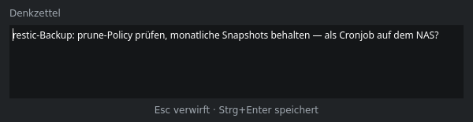
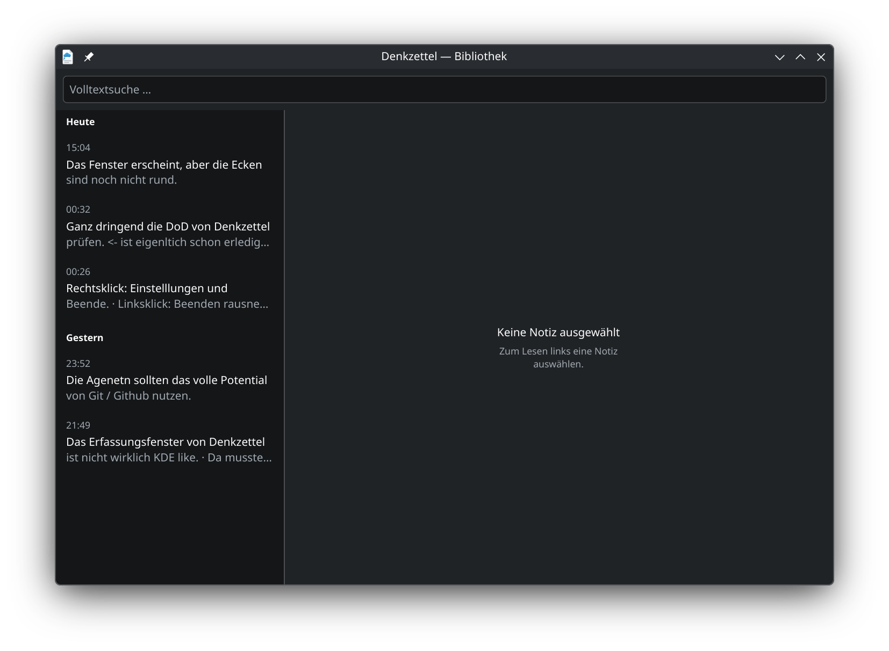

# Denkzettel

Ein Notizzettel für KDE Plasma, der aufgeht, wenn man ihn braucht, und
verschwindet, wenn man fertig ist.



`Meta+N` drücken, tippen, `Strg+Enter`. Die Notiz ist gespeichert, das Fenster
ist weg. Kein Dateiname, kein Speichern-Dialog, keine Frage, wohin damit.

Ich habe Denkzettel gebaut, weil mir beim Arbeiten ständig Sachen einfallen,
die woanders hingehören: eine Idee, eine offene Frage, ein Kommandozeilen-Fund.
Wenn ich dafür erst eine Datei anlegen muss, ist der Gedanke weg. Was sich
lohnt, wandert später in den Obsidian-Vault.

Den Code schreibe ich nicht selbst: **Denkzettel wird von Claude-Code-Agenten
entwickelt**, ich bin der Kunde des Teams —
[Wie hier gearbeitet wird](#wie-hier-gearbeitet-wird).

- [Funktionen](#funktionen)
- [Installation](#installation)
- [Bedienung](#bedienung)
- [Mitwirken](#mitwirken)
  - [Bauen und Testen](#bauen-und-testen)
  - [Linter](#linter)
  - [Wie hier gearbeitet wird](#wie-hier-gearbeitet-wird)
  - [Verzeichnisse](#verzeichnisse)
- [Name](#name)
- [Lizenz](#lizenz)

## Funktionen

- Erfassen mit einem Tastendruck, ohne Dateinamen und ohne Dialog
- Bibliothek mit allen Notizen, nach Tagen gruppiert wie ein Posteingang
- Volltextsuche, die Umlaute und Wortanfänge verzeiht: „bucher" findet
  „Bücher", „grafieren" findet „fotografieren"
- Bearbeiten mit Rückfrage, bevor ungespeicherte Änderungen verlorengehen
- Symbole und Beschriftungen aus dem System; ein Wechsel des Farbschemas wird
  sofort übernommen
- Das Erfassungsfenster trägt die Hülle des Desktop-Themes — Rundung, Kontur
  und Schatten kommen von dort, nicht aus fest eingebauten Werten
- Läuft im Hintergrund, sitzt im Systemabschnitt der Kontrollleiste, startet
  mit der Sitzung
- Alles bleibt lokal in einer SQLite-Datei



> **Zu den Bildern:** Sie zeigen den Stand vom 04.08.2026. Seither hat das
> Erfassungsfenster ein sichtbares Eingabefeld bekommen und die Notizliste
> Trennlinien zwischen Einträgen und Gruppen. Erneuert werden die Bilder,
> sobald [#96](https://github.com/hnsstrk/denkzettel/issues/96) behoben ist —
> der Bildläufer zeichnet Fläche und Schrift derzeit aus zwei Quellen, die
> nichts voneinander wissen.

Auf der Liste stehen noch: Sprachnotizen mit Transkription, eine KI, die
sortiert und Vorschläge macht, Export nach Obsidian und Taskwarrior. Was
gerade ansteht, steht in den
[Issues](https://github.com/hnsstrk/denkzettel/issues).

## Installation

Fertige Pakete gibt es noch nicht — Denkzettel wird bis auf Weiteres aus dem
Quelltext gebaut. Gebraucht werden CMake ab 3.20, Qt 6.7 (DBus, Widgets, Sql),
die KDE Frameworks 6 (Config, CoreAddons, DBusAddons, GlobalAccel, I18n,
Notifications, StatusNotifierItem, Svg, WidgetsAddons, WindowSystem) und ECM.
Auf Arch und CachyOS:

```
sudo pacman -S cmake extra-cmake-modules qt6-base kconfig kcoreaddons kdbusaddons \
    kglobalaccel ki18n knotifications kstatusnotifieritem ksvg kwidgetsaddons kwindowsystem
```

Das Erfassungsfenster holt seine Hülle aus dem Desktop-Theme. Wo keins
installiert ist, zeichnet es eine schlichte Fläche und bleibt benutzbar —
für das Theme sorgt auf Arch `libplasma`.

```
cmake -B build -S . -DCMAKE_INSTALL_PREFIX=/usr
cmake --build build
sudo cmake --install build
```

Das Präfix `/usr` ist nicht kosmetisch: Der Kürzeldienst von Plasma findet die
Aktion nur, wenn die Desktop-Datei systemweit liegt. Danach `denkzetteld`
starten oder einmal neu anmelden; der Autostart-Eintrag übernimmt es künftig.

## Bedienung

`Meta+N` öffnet das Erfassungsfenster, `Strg+Enter` speichert, `Esc` verwirft.
Die Bibliothek erreicht man über das Tray-Symbol. Dort öffnet `F2` den Editor,
`Entf` löscht mit Rückgängig-Möglichkeit.

`denkzetteld --version` sagt, welche Fassung läuft, `denkzetteld --help`
listet die Schalter. Beide antworten auch, während der Dienst schon läuft.

Für Skripte gibt es eine D-Bus-Schnittstelle:

```
qdbus6 org.denkzettel.Daemon /Daemon AddNote "Text der Notiz"
qdbus6 org.denkzettel.Daemon /Daemon ShowLibrary
```

Die Notizen liegen in `~/.local/share/denkzettel/denkzettel.db`. Nichts
verlässt den Rechner. Ändert ein Update das Schema, wird der Bestand beim
ersten Start umgewandelt; was sich ändert, steht im [Changelog](CHANGELOG.md).

## Mitwirken

Fehlermeldungen und Ideen gern als [Issue](https://github.com/hnsstrk/denkzettel/issues).
Wer Code beisteuern will, findet hier den Einstieg.

### Bauen und Testen

```
cmake -B build -S . -DCMAKE_BUILD_TYPE=Debug
cmake --build build
ctest --test-dir build
```

Die Tests laufen offscreen und brauchen keine laufende Plasma-Sitzung. Die
fünf Bildläufer (`editshots`, `libraryshots`, `searchshots`, `readmeshots`,
`captureshots`) baut ein gewöhnlicher Build seit dem 04.08.2026 mit. Sie stehen weiterhin
**nicht** in `ctest` — ein kaputter Bildschreiber soll die Suite nicht rot
färben —, aber ein Läufer, den niemand neu baut, altert unbemerkt und schreibt
plausible Bilder eines alten Standes.

Die beiden Bilder oben in dieser Datei stammen aus `readmeshots` und sind mit
einem Befehl neu zu erzeugen:

```
QT_QPA_PLATFORM=offscreen QT_QPA_PLATFORMTHEME=kde QT_SCALE_FACTOR=2 \
    LANG=de_DE.UTF-8 build/bin/readmeshots docs/bilder
```

Der Läufer arbeitet deterministisch: Zwei Läufe hintereinander liefern
bytegleiche Dateien. Die darin gezeigten Notizen sind erfunden. Das
Plattformthema muss gesetzt sein, sonst tritt eine Ersatzschrift an die Stelle
der echten und stellt die Größenverhältnisse falsch dar.

### Linter

Zwei Targets, die auf Anforderung laufen und nichts verändern:

```
cmake --build build --target lint-tidy    # clang-tidy
cmake --build build --target lint-clazy   # clazy, Qt-Semantik
```

Beide sehen nur `src/` und `tests/` und stehen auf **null Befunden** — in der
Standardkonfiguration, also ohne `-DDENKZETTEL_SPIKE_SPELLFIX=ON`; mit dem
Spike sind es drei, alle in dessen eigener Datei. Eine Null ohne genannte
Schalterstellung ist keine Aussage. Der automatische Lauf hält sie dort. Wo ein Befund bewusst stehenbleibt, steht ein
`NOLINT` mit der Begründung daneben. Bekannte Lücke: clazy prüft `tr()`, wir
benutzen aber `i18n()`.

### Wie hier gearbeitet wird

Denkzettel wird mit KI entwickelt. Den Produktivcode, die Tests und die
Den Code schreiben Claude-Code-Agenten in festen Rollen — Product Owner,
Entwicklung, UI/UX. Bei mir liegen Ziele, Prioritäten, Freigaben und die
Abnahme. Die meisten Commits tragen deshalb einen
`Co-Authored-By: Claude`-Vermerk.

Der Backlog sind die [Issues](https://github.com/hnsstrk/denkzettel/issues) mit
ihren Akzeptanzkriterien; die bindende Spezifikation ist [`SPEC.md`](SPEC.md).
Bis August 2026 lag daneben ein umfangreicher Prozessapparat aus
Sprint-Protokollen, Vorprüf- und Prüfberichten. Er ist entfernt: Zuletzt standen
zehn Zeilen Bericht gegen jede Zeile Code, und die meisten Befunde betrafen die
Prüfung selbst statt das Produkt. Geblieben sind die vier Prüfregeln, die
tatsächlich Fehler im Programm gefunden haben — sie stehen in
[`CLAUDE.md`](CLAUDE.md).

Jeder Push auf `main` und jeder Pull Request lösen einen Bau- und Testlauf aus
([`.github/workflows/ci.yml`](.github/workflows/ci.yml)). Er läuft in einem
Arch-Container und schlägt bei jedem Baufehler, jeder Compiler-Warnung, jedem
roten Test und **jedem Linterbefund** fehl — `lint-tidy` und `lint-clazy`
stehen seit dem 05.08.2026 beide auf null. Was er **nicht** prüft, steht im Kopf der Datei: Der
Lauf hat keine grafische Sitzung, installiert nichts und erzeugt keine Bilder —
die Prüfung am installierten Stand und die Bildprüfung bleiben Handarbeit.

### Verzeichnisse

```
src/capture     Erfassungsfenster
src/store       SQLite-Zugriff, Schema, Volltextindex
src/ui          Bibliothek
src/shell       Tray, globale Kürzel, D-Bus
tests/          Unit-Tests und Bildläufer
wireframes/     die verbindlichen Zeichnungen
third_party/    Fremdcode (spellfix aus SQLite)
```

## Name

Ein Denkzettel ist eine Gedächtnisstütze, und wer einen verpasst bekommt,
vergisst die Sache so schnell nicht. Am 31.07.2026 gegen rund 400 bestehende
Notiz-Apps sowie AUR, crates.io, PyPI, Flathub und GitHub geprüft: frei.

## Lizenz

[MIT](LICENSE). Nehmt den Code, baut darauf auf, verkauft ihn meinetwegen —
der Copyright-Hinweis muss nur mit.

Zwei Dinge dazu: `third_party/spellfix/spellfix.c` kommt aus SQLite und ist
Public Domain. Und wer Denkzettel als fertiges Programm weitergibt, muss die
Bedingungen von Qt und den KDE Frameworks beachten, die dynamisch dazugelinkt
werden — die stehen unter LGPL.
