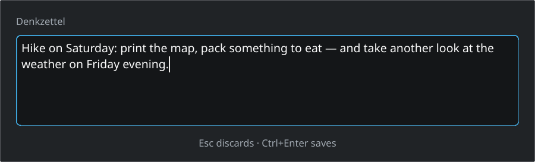
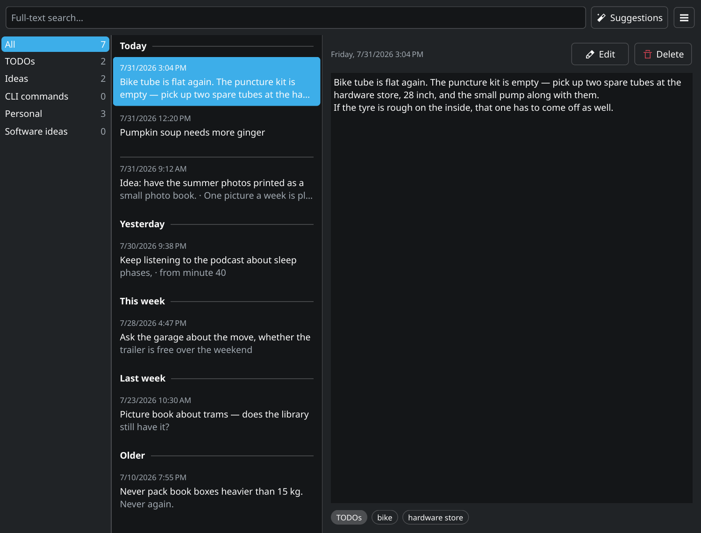

# Denkzettel

[](https://github.com/hnsstrk/denkzettel/actions/workflows/ci.yml)
[](LICENSE)

A quick-capture scratchpad for KDE Plasma. Press `Meta+N`, type, press
`Ctrl+Enter` — the note is stored and the window is gone. No file name, no save
dialog, no question where to put it.

🇩🇪 [Deutsche Fassung](README.de.md)

> **The interface is English.** A German translation ships with the source
> (`po/de/denkzettel.po`) and is installed with the program, so a German
> session gets German without any further setup.



I built Denkzettel because things keep occurring to me while I work that belong
somewhere else: an idea, an open question, a command line I want to keep. If I
have to create a file for that first, the thought is gone. Whatever turns out to
be worth keeping moves into my Obsidian vault later.

I do not write the code myself: **Denkzettel is developed with Claude Code**, I
set the goals, the priorities and the acceptance —
[How this project is run](#how-this-project-is-run).

## What it does

- **Capture with one key press**, without a file name and without a dialog.
  `Meta+N` is registered as a global shortcut through KGlobalAccel; if another
  component already holds it, the first start says so in a notification instead
  of failing silently.
- **A library of all notes**, grouped by day like an inbox: Today, Yesterday,
  This week, Last week, Older. `F2` opens the editor, `Del` deletes with five
  seconds of undo, `Ctrl+Enter` saves an edit and `Esc` cancels it. Leaving an
  edit with unsaved changes asks first.
- **Full-text search** over a SQLite FTS5 trigram index. It matches inside
  words, not just at their start — `grafieren` finds `fotografieren` — and it
  folds diacritics, so `bucher` finds `Bücher`. Terms of one or two characters
  cannot be in a trigram index and fall back to a substring comparison, so `KI`
  finds something instead of nothing. `ß` is not folded; that is a limit of the
  tokenizer and it is covered by a test that says so.
- **Icons and labels come from the system**, and a colour-scheme change is
  picked up while the program runs.
- **The capture window wears the shell of the desktop theme** — rounding,
  outline, shadow, the frame of the input field and its focus layer are drawn
  from the theme, not from built-in values.
- **Runs in the background**, sits in the system tray, starts with the session.
- **Everything stays local** in one SQLite file. Nothing leaves the machine.



### Not built yet

The specification describes considerably more than the program does today. What
is written down and not built:

- **Voice notes** with recording window and transcription (whisper.cpp,
  WhisperX). The tray entry exists and is disabled.
- **AI analysis** — classification, tags, a category sidebar, Ollama and
  OpenAI-compatible providers. The tray entry exists and is disabled.
- **Suggestions** — embeddings, topic clustering, bundle and task proposals with
  a review UI. The tray entry exists and is disabled.
- **Export** to Obsidian and Taskwarrior, and a full export as a way out.
- **A settings dialog.** There is none; what can be configured is configured in
  `denkzettelrc` or not at all.
- **Search operators** (`tag:`, date ranges and the rest of SPEC 6). The search
  takes plain terms today and combines them with AND.
- **Packages.** Denkzettel is built from source; there is no PKGBUILD yet.

What is currently being worked on is in the
[issues](https://github.com/hnsstrk/denkzettel/issues); the binding
specification is [`SPEC.md`](SPEC.md).

## Requirements

- CMake 3.20 or newer, a C++20 compiler, `extra-cmake-modules`
- Qt 6.7 (DBus, Widgets, Sql)
- KDE Frameworks 6: ColorScheme, Config, CoreAddons, DBusAddons, GlobalAccel,
  I18n, Notifications, StatusNotifierItem, Svg, WidgetsAddons, WindowSystem
- gettext (`msgfmt`) for the message catalogues
- libplasma at runtime — it ships the desktop themes the capture window draws
  its shell from — plus Breeze icons

On Arch and derivatives:

```sh
sudo pacman -S --needed cmake extra-cmake-modules gettext qt6-base \
    kcolorscheme kconfig kcoreaddons kdbusaddons kglobalaccel ki18n \
    knotifications kstatusnotifieritem ksvg kwidgetsaddons kwindowsystem \
    libplasma breeze-icons
```

## Build and install

```sh
cmake -B build -S . -DCMAKE_INSTALL_PREFIX=/usr
cmake --build build
sudo cmake --install build
```

Where no terminal can ask for the password, the same step through a graphical
dialog — `pkexec` needs absolute paths for both the program and the build
directory:

```sh
pkexec /usr/bin/cmake --install "$PWD/build"
```

The prefix `/usr` is not cosmetic. Plasma's shortcut service only finds the
action when the desktop file lies system-wide, and the autostart entry is only
read from `/etc/xdg/autostart`, which is where the prefix `/usr` puts it.

Afterwards start `denkzetteld` once or log in again; from then on the autostart
entry does it.

## Everyday use

`Meta+N` opens the capture window, `Ctrl+Enter` saves, `Esc` discards. The
library is reached from the tray icon.

`denkzetteld --version` says which version is running, `denkzetteld --help`
lists the switches. Both answer while the service is already running.

For scripts there is a D-Bus interface, `org.denkzettel.Daemon` at `/Daemon`:

```sh
qdbus6 org.denkzettel.Daemon /Daemon AddNote "text of the note"
qdbus6 org.denkzettel.Daemon /Daemon ShowCapture
qdbus6 org.denkzettel.Daemon /Daemon ShowLibrary
qdbus6 org.denkzettel.Daemon /Daemon Quit
```

`AddNote` returns the id of the new note, or 0 when nothing was stored.

The notes live in `~/.local/share/denkzettel/denkzettel.db`. If an update
changes the schema, the existing database is migrated on the first start; what
changes is recorded in the [changelog](CHANGELOG.md).

## Contributing

Bug reports and ideas are welcome as an
[issue](https://github.com/hnsstrk/denkzettel/issues). Whoever wants to
contribute code starts here.

### Build and test

```sh
cmake -B build -S . -DCMAKE_BUILD_TYPE=Debug
cmake --build build
ctest --test-dir build
```

The tests run offscreen and need no running Plasma session.

### Linters

Two targets that run on demand and change nothing:

```sh
cmake --build build --target lint-tidy    # clang-tidy
cmake --build build --target lint-clazy   # clazy, Qt semantics
```

Both see `src/` and `tests/` only and stand at **zero findings**. Where a
finding deliberately stays, a `NOLINT` with its reason stands next to it. Known
gap: clazy checks `tr()`, this project uses `i18n()`.

### Screenshots

The pictures in both READMEs come from `readmeshots`, which is built with the
test suite but deliberately kept out of `ctest`: a broken screenshot writer must
not turn the suite red. It is built all the same, because a runner nobody
rebuilds ages unnoticed and then writes plausible pictures of an *old* state
with a fresh timestamp.

One run writes **one** language set, and three things in the picture have three
different sources: the interface strings come from the message catalogue
(`LANGUAGE`), the timestamps come from `QLocale` (`LANG`/`LC_ALL`), and the
invented notes follow the locale as well. All three have to be set together, or
the result is the worst kind of picture — one that looks plausible and shows an
English window with German dates in it.

The runner also throws away its own configuration directory, so that the
pictures show the state as shipped and not the window size somebody has stored.
That has a second consequence: without a `plasmarc` it falls back to the default
(light) desktop theme while it sets a dark palette itself, and the note text
then stands light on light. So point it at a matching theme.

```sh
cmake --build build --target readmeshots

conf=$(mktemp -d)
printf '[Theme]\nname=breeze-dark\n' > "$conf/plasmarc"

# English — the source language, no catalogue involved
env -u LANGUAGE LANG=en_US.UTF-8 LC_ALL=en_US.UTF-8 \
    XDG_CONFIG_DIRS="$conf:/etc/xdg" \
    QT_QPA_PLATFORM=offscreen QT_QPA_PLATFORMTHEME=kde QT_SCALE_FACTOR=1.5 \
    build/bin/readmeshots docs/images

# German — the catalogue has to be findable at runtime. Installed into a
# throwaway root with DESTDIR, nothing is written outside it.
dest=$(mktemp -d)
DESTDIR="$dest" cmake --install build

env LANGUAGE=de LANG=de_DE.UTF-8 LC_ALL=de_DE.UTF-8 \
    XDG_DATA_DIRS="$dest/usr/share:/usr/share" XDG_CONFIG_DIRS="$conf:/etc/xdg" \
    QT_QPA_PLATFORM=offscreen QT_QPA_PLATFORMTHEME=kde QT_SCALE_FACTOR=1.5 \
    build/bin/readmeshots docs/images/de
```

The check that turns the second call into evidence is the same call **without**
`XDG_DATA_DIRS`: the window has to come out English then. If it does not, the
catalogue was never what made the difference. One trap in that check: the line
`-h, --help  Zeigt Hilfe …` is German either way — it comes from Qt's own
catalogue, not from this project's, and proves nothing.

`QT_QPA_PLATFORMTHEME=kde` has to be set: without it a substitute font takes the
place of the real one and gets the proportions wrong. The runner works
deterministically — two runs in a row deliver byte-identical files. The notes
shown in the pictures are invented.

Both pictures are produced offscreen. That shows geometry, typesetting, colour
roles and the frame the desktop theme draws — it does **not** show the shadow
and the blur behind the capture window, which the compositor contributes and
which no offscreen run has.

### How this project is run

Denkzettel is developed with AI. Claude Code writes the production code, the
tests and the checks. Goals, priorities, approvals and acceptance are mine. Most
commits therefore carry a `Co-Authored-By: Claude` line.

The backlog is the [issues](https://github.com/hnsstrk/denkzettel/issues) with
their acceptance criteria; the binding specification is [`SPEC.md`](SPEC.md).
Until August 2026 an extensive process apparatus of sprint records and review
reports stood beside it. It has been removed: in the end ten lines of report
stood against every line of code, and most findings concerned the checking
rather than the product. What remains are the four rules that actually found
faults in the program — they are in [`CLAUDE.md`](CLAUDE.md).

Every push to `main` and every pull request trigger a build and test run
([`.github/workflows/ci.yml`](.github/workflows/ci.yml)). It runs in an Arch
container and fails on every build error, every compiler warning, every red test
and **every linter finding**. Since 2026-08-11 it builds and checks **two build
types**, `Debug` and `Release`: Qt sets `QT_NO_DEBUG` for every build type
except `Debug`, and under it `Q_ASSERT` leaves its condition unchecked — a
difference a run with a single build type cannot see (#99). What the run does
**not** cover stands at the top of the file: it has no graphical session,
installs nothing and produces no pictures. Checking the installed state and
checking the pictures stay manual work.

### Directory layout

```
src/capture     capture window
src/store       SQLite access, schema, full-text index
src/ui          library
src/shell       tray, global shortcuts, D-Bus
src/analysis    AI pipeline (reserved by SPEC 2.2, still empty)
src/transcribe  Whisper backends (reserved by SPEC 2.2, still empty)
src/proposals   suggestion generation and execution (reserved by SPEC 2.2, empty)
tests/          unit tests and the screenshot runner
po/             message catalogues (German)
icons/          application and tray icons
desktop/        the desktop entry
cmake/          helper modules for the lint targets
wireframes/     the binding drawings
docs/           the images used in this file
recherche/      dated research notes behind design decisions
third_party/    foreign code (spellfix from SQLite)
```

## The name

*Denkzettel* is German for a reminder — and someone who is handed one does not
forget the matter in a hurry. Checked on 2026-07-31 against some 400 existing
note apps as well as AUR, crates.io, PyPI, Flathub and GitHub: free.

## License

[MIT](LICENSE). Take the code, build on it, sell it for all I care — the
copyright notice just has to come along.

Two things about that: `third_party/spellfix/spellfix.c` comes from SQLite and
is public domain. And whoever passes Denkzettel on as a finished program has to
observe the terms of Qt and the KDE Frameworks, which are linked in dynamically
— those are LGPL.
