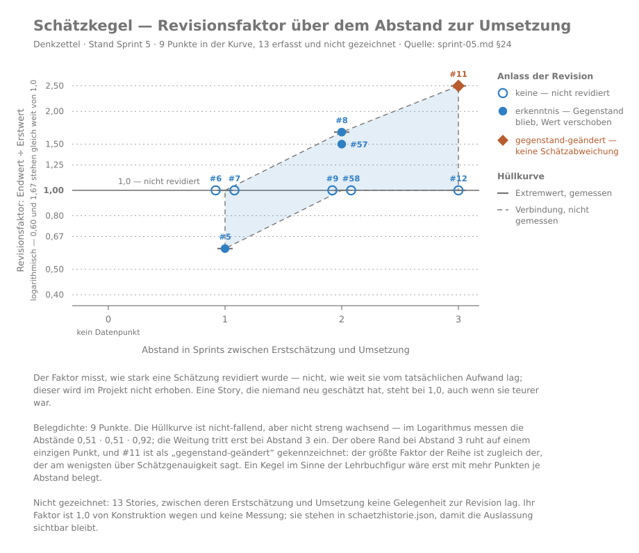

# Denkzettel

Ein flüchtiger Scratchpad für KDE Plasma — ein Tastendruck hin, ein Tastendruck weg.

Ein durchgehender Puffer statt vieler Dateien: kein Dateiname, kein Speichern-Dialog, keine Ablage-Entscheidung. Gedanken beim Arbeiten und Testen festhalten; was wichtig wird, wandert von Hand ins Hauptbuch (den Obsidian-Vault).

**Status:** In Entwicklung — gebaut sind Daemon mit Tray, Erfassungsfenster, globales Kürzel und Autostart; dazu die Bibliothek mit Volltextsuche, einer Notizliste, die nach Tagen gegliedert ist wie ein Posteingang (Heute · Gestern · Diese Woche · Letzte Woche · Älter), und dem Bearbeiten von Notizen mit Wächterdialog gegen ungespeicherte Änderungen. Die Suche findet auch bei fehlenden Umlauten und mitten im Wort — „bucher" findet „Bücher", „grafieren" findet „fotografieren". Schaltflächen und Menüeinträge tragen Symbole und deutsche Beschriftungen, im Tray-Menü steht „Beenden" abgesetzt. Beim Klick auf eine sichtbare Notiz bleibt die Liste stehen, und ein Wechsel des Farbschemas geht ohne Neustart mit.

## Wie dieses Projekt schätzt



Denkzettel entsteht in Sprints mit geschätzten Stories. Der Kegel zeigt, wie
stark Schätzungen später revidiert wurden — je weiter eine Schätzung von der
Umsetzung entfernt lag, desto mehr. Er misst **nicht** den Abstand zum
tatsächlichen Aufwand; der wird im Projekt nicht erhoben. Datenreihe und
Generator liegen unter `docs/scrum/diagramme/`, die Werte stammen aus den
Sprint-Protokollen.

## Linter

Zwei CMake-Targets prüfen den Quellcode auf Anforderung; der normale Build enthält keine Analyse:

```
cmake --build build --target lint-tidy    # clang-tidy: bugprone-*, performance-*, misc-const-correctness
cmake --build build --target lint-clazy   # clazy: Qt-Semantik, Stufen level0 und level1
```

Beide lesen die Compile-Datenbank des Build-Verzeichnisses und sehen nur `src/` und `tests/`, keine erzeugten Dateien. `lint-tidy` prüft über `.clang-tidy` zusätzlich, dass der Rückgabewert einer Registrierung bei einem fremden Dienst nicht ignoriert wird. Beide melden nur und ändern nichts — clazys Fixit-Automatik bleibt bewusst aus. Bekannter blinder Fleck: clazy kennt nur `tr()`-Checks und prüft unsere `i18n()`-Aufrufe nicht.

## Name

Ein Denkzettel ist eine Gedächtnisstütze — und wer einen verpasst bekommt, vergisst die Sache nicht so schnell. Der Name wurde am 31.07.2026 gegen ein Inventar von rund 400 existierenden Notiz-Apps sowie AUR, crates.io, PyPI, Flathub und GitHub geprüft: frei.
