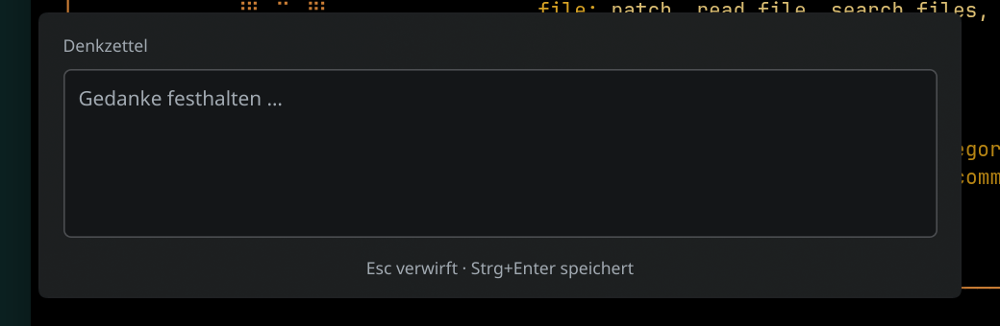
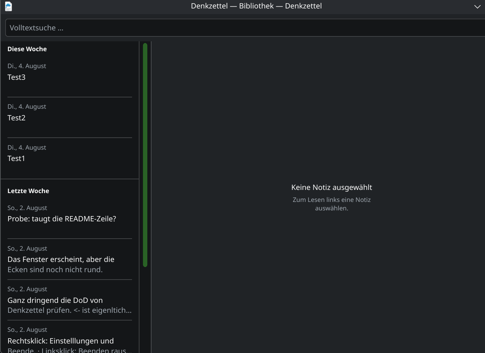
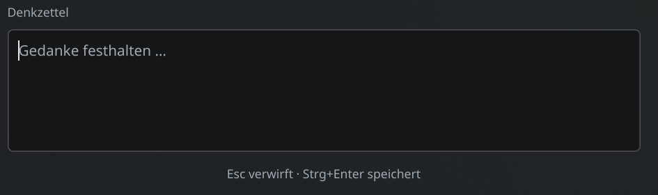
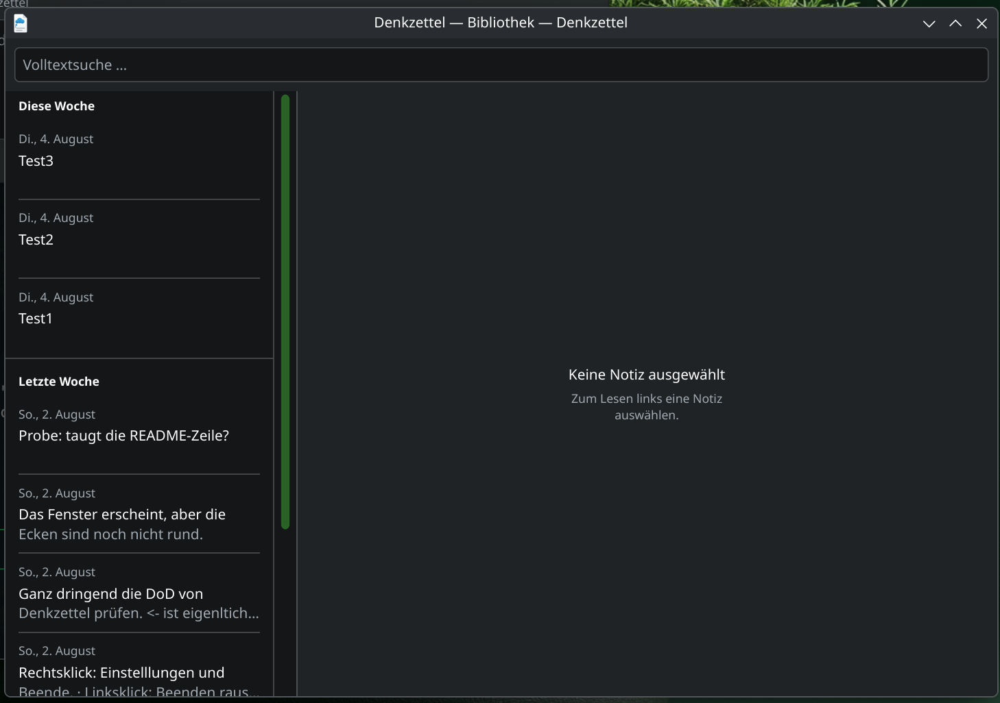

# Sprint 9 — Installation und Hauptwege am installierten Stand

> **Nachtrag vom 08.08.2026, 00:45 — dieser Bericht war überholt (Mangel M9).**
> Der Durchgang unten lief an `a15470f`. Danach hat der karpathy-Nachlauf einen
> `fail` gebracht (N1), und seine Heilung änderte **25 Zeilen Produktivcode** in
> `src/ui/notelistdelegate.cpp` — genau an den Trennlinien, die das Bild in
> Abschnitt 3 zeigt. Die Änderung verschiebt die Linie in 8 von 280 Lagen um
> einen Gerätebildpunkt.
>
> Damit belegte dieser Bericht einen Stand, den es nicht mehr gab. Gefunden hat
> es der Scrum Master bei der DoD-Prüfung, an den Prüfsummen:
> `/usr/bin/denkzetteld` trug `7e23862e…` (Stand `a15470f`), das Bauverzeichnis
> `b206a483…` (Stand `01e1c6b`).
>
> **Das ist B16 eine Ebene höher:** nicht ein laufender Dienst, der die
> gelöschte Datei weiterhält, sondern eine Abnahme, die einen überholten Stand
> belegt. Der Durchgang unten bleibt stehen — er war zu seiner Zeit richtig —,
> und Abschnitt 6 trägt den Wiederholungslauf am wirklichen Endstand.

**Durchgeführt vom Product Owner am 07.08.2026, 23:37–23:39.**
Stand: `a15470f` (Sprint-Endstand nach allen Review-Behebungen).

Dieser Schritt erfüllt **DoD 2** in der Fassung für parallel arbeitende
Stränge: Weil der PO den Strängen die eigenmächtige Installation untersagt hat,
trägt er die Pflicht, den Endstand einmal zu installieren und den Hauptweg
jeder Story daran auszuführen.

## 1. Der Stand, an dem geprüft wurde

```
$ pkexec /usr/bin/cmake --install /home/hnsstrk/Projekte/denkzettel/build
-- Install configuration: "Debug"
-- Installing: /usr/bin/denkzetteld
```

**Vor der Prüfung wurde der laufende Dienst beendet und neu gestartet** (B16 —
ein laufender Dienst hält die gelöschte alte Datei weiter, und dann prüft man
unbemerkt den falschen Stand):

```
$ readlink /proc/508680/exe
/usr/bin/denkzetteld
```

**Ohne `(deleted)`.** Der Dienst führt die eben installierte Datei aus.

## 2. Hauptweg #100 — der Eingabebereich ist erkennbar

Angefordert über einen zweiten Start, den `KDBusService::Unique` an den
laufenden Dienst weiterreicht.



Das Textfeld ist als abgesetzter Bereich mit eigener Kante zu sehen, darin der
Platzhalter „Gedanke festhalten …", darunter unverändert die Fußzeile
„Esc verwirft · Strg+Enter speichert".

**Der Kundenbefund vom 05.08.2026** — *„Das Erfassungsfenster ist ein Farbblock.
Der Eingabebereich ist nicht klar erkennbar."* — ist am installierten Stand
geheilt.

## 3. Hauptweg #101 — Notizen und Gruppen sind getrennt

Angefordert über `ShowLibrary()` auf `org.denkzettel.Daemon`, Objekt `/Daemon`.



Im Bild ist die Festlegung vollständig abzulesen:

| Stelle | erwartet | im Bild |
|---|---|---|
| über dem **ersten** Kopf „Diese Woche" | keine Linie | keine |
| zwischen Test3 und Test2, Test2 und Test1 | eingerückte Linie | eingerückt, beidseitig abgesetzt |
| unter Test1 (letzte Notiz der Gruppe) | keine Linie | keine |
| über „Letzte Woche" | Linie über die volle Breite | volle Breite bis an beide Kanten |
| zwischen den Notizen der zweiten Gruppe | eingerückte Linie | eingerückt |

**Der Kundenbefund** — *„In der Bibliothek lassen sich die einzelnen Notizen
optisch nicht sauber voneinander unterscheiden, weil ein Trenner fehlt. Gleiches
gilt für ‚Gestern' und ‚Letzte Woche'."* — ist am installierten Stand geheilt,
und zwar in **beiden** Hälften.

## 4. Was diese Prüfung nicht leistet

- **Sie ersetzt das Kundenurteil nicht.** Ob die Abhebung des Feldes und die
  Sichtbarkeit der Linien das Auge des Kunden erreichen, entscheidet er. Die
  Messwerte stehen im UI-Review (`sprint-09-ui-review/bericht.md`): Feld gegen
  Hülle 1,79 : 1 in der Sitzung, Linien 1,24 : 1 im schwächsten Schema.
- **`Meta+N` ist nicht ausgelöst worden.** Ein Agent kann unter Wayland kein
  globales Kürzel drücken; die Registrierung ist belegt, die Wirkung nicht
  (offener AK-Haken aus #61, unverändert). Geprüft ist der Weg über den
  Dienst, den das Kürzel ebenfalls nimmt.
- **Die Bibliothek ist über D-Bus geöffnet worden**, nicht über das Tray-Menü.
  Ein Agent kann kein Tray-Menü bedienen. Beide Wege enden in `ShowLibrary()`.

## 5. Zur Ablage der Bilder

Die Belege sind **Zuschnitte**. Die Vollbilder der Sitzung zeigten Hostname,
Prozessor, Grafikkarte und die lokale Netzadresse; sie sind nach dem Zuschneiden
gelöscht worden und nicht ins Repositorium gelangt. Das Repositorium ist
öffentlich, und Systemdetails sind dort nach der Kundenentscheidung vom
02.08.2026 nicht zugelassen.

---

## 6. Wiederholung am wirklichen Endstand (08.08.2026, 00:45)

Anlass ist der Nachtrag oben. Geprüft wird `01e1c6b`.

### 6.1 Der Stand, an dem geprüft wurde

Diesmal ist die Gleichheit **an der Prüfsumme** belegt und nicht am Pfad allein:

```
vorher    /usr/bin/denkzetteld     7e23862e745a9381670ca89cae6b3d35   (a15470f)
          build/bin/denkzetteld    b206a483dd251150dc4598ad3cd4c9f7   (01e1c6b)

nach der Installation
          /usr/bin/denkzetteld     b206a483dd251150dc4598ad3cd4c9f7
          build/bin/denkzetteld    b206a483dd251150dc4598ad3cd4c9f7
```

Dienst beendet, neu gestartet, und die **laufende** Datei gegengeprüft:

```
readlink /proc/597929/exe   →  /usr/bin/denkzetteld      (ohne "(deleted)")
md5sum   /proc/597929/exe   →  b206a483dd251150dc4598ad3cd4c9f7
```

**Die Prüfsumme des laufenden Prozesses ist der Beleg, den der erste Durchgang
schuldig blieb.** `readlink` sagt, welche Datei läuft; erst die Prüfsumme sagt,
**welcher Stand** darin steckt. Genau diese Lücke hat M9 möglich gemacht.

### 6.2 Hauptweg #100 am Endstand



Das Textfeld ist als abgesetzte Fläche mit eigener Kante zu sehen, darin der
Platzhalter und der Schreibcursor, darunter die Fußzeile.

### 6.3 Hauptweg #101 am Endstand



Die Linienregel ist unverändert vollständig abzulesen: über dem ersten Kopf
keine Linie, zwischen den Notizen eingerückte, unter der letzten Notiz einer
Gruppe keine, über dem zweiten Kopf eine über die volle Breite.

**Die Bilder aus Abschnitt 2 und 3 bleiben liegen** (B17): Sie zeigen, was der
vorige Stand zeichnete, und der Unterschied zwischen beiden Paaren ist der
Gegenstand dieses Nachtrags.

### 6.4 Was auch dieser Durchgang nicht leistet

Unverändert: `Meta+N` bleibt ungedrückt (kein Agent löst unter Wayland ein
globales Kürzel aus), die Bibliothek wird über D-Bus geöffnet statt über das
Tray-Menü, und ob die Abhebung das Auge des Kunden erreicht, entscheidet er.

Die Vollbilder sind auch diesmal nach dem Zuschneiden gelöscht worden und nicht
ins Repositorium gelangt.
